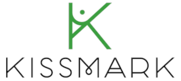

# Hi I'm kissmark 👋

  

# About me
### I am curious and passionate about programming and robotics, this has allowed me to solve problems related to the area where I work. I have a high sense of responsibility and I want each project to challenge me technically.

# Languages and Tools:

   
  
  
   
  
  
  
   
  
   
  </a> 

<!--
**kissmarkrivas/kissmarkrivas** is a ✨ _special_ ✨ repository because its `README.md` (this file) appears on your GitHub profile.

Here are some ideas to get you started:

- 🔭 I’m currently working on ...
- 🌱 I’m currently learning ...
- 👯 I’m looking to collaborate on ...
- 🤔 I’m looking for help with ...
- 💬 Ask me about ...
- 📫 How to reach me: ...
- 😄 Pronouns: ...
- ⚡ Fun fact: ...
-->
